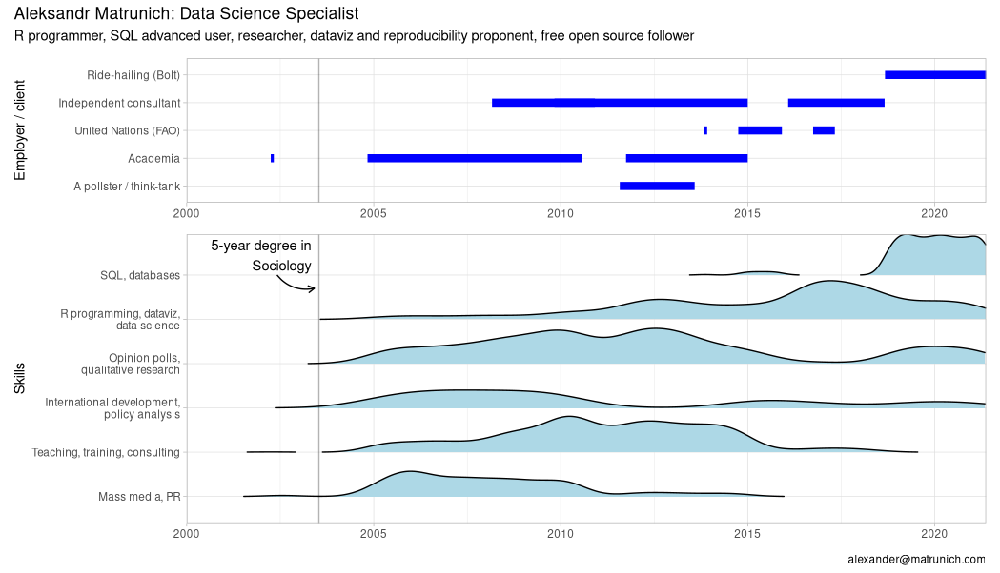
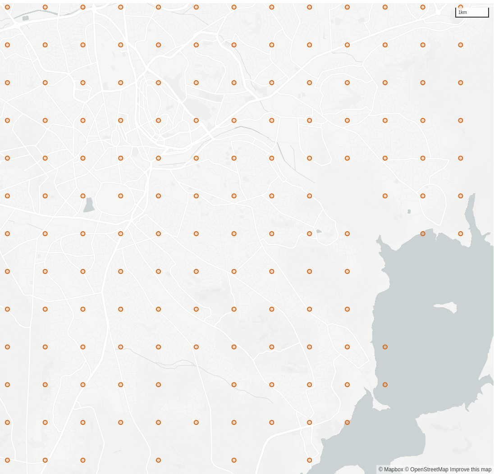

```{r setup, include=FALSE}
knitr::opts_chunk$set(echo = FALSE)
```

# Plan

* The task
* Available instruments
  * Goolge Looker BI
  * Amazon Redshift database
  * R
* A note on longitude
* The mathematics: unfortunately, Earth is not flat


## About the speaker 




# Data and business intelligence in Bolt

* Data lake: Redshift + Airflow
* Data science: Python / Jupiter notebooks
* Analytics and business intelligence: Looker

# What is Looker?

> Looker makes use of a simple modeling language called LookML that lets data teams define the relationships in their database so business users can explore, save, and download data without needing to know SQL.

[Wikipedia](https://en.wikipedia.org/wiki/Looker_(company)#History)

## Comparing to R 

In terms of R environment, Looker is like a web-browser-based mix of Shiny and RMarkdown on the top of an SQL database.

## Looker: under the hood

The most of data wrangling and calculations are to be run in SQL. Then user's web-browser receives the data (up to 5K rows) and builds a table, or a visualization, or a set of them (a dashboard).

Some calculations can be applied to the received dataset on the browser level.

Why the 5K limit? To save your browser.

## A LookML example

<pre><code data-line-numbers="1-7|8-12|13-22">
  dimension_group: partner_life_cycle {
    type: duration
    intervals: [day, week, month, year]
    description: "Duration between first and last ride"
    sql_start: ${partner_first_ride_raw} ;;
    sql_end: ${partner_last_ride_raw} ;;
  }
  dimension: partner_rides_per_week {
    description: "Rough estimation of partner's supply intensity. 
    It is zero for life cycles shorter than 7 days."
    type: number
    sql: 
    CASE WHEN ${days_partner_life_cycle} >= 7 
      THEN 7.0 * ${partner_total_rides} / ${days_partner_life_cycle} 
      ELSE 0 END ;;
    value_format_name: decimal_1
  }
</code></pre>

# The task: a spatial heatmap in Looker


# Our options

* Looker's built-in heatmaps;
* Rounded coordinates;
* A map layer with polygons and...
  * SQL-based `is_within` matching;
  * SQL-based polygon ID generating.
  
# Looker heatmaps

Looker [provides](https://docs.looker.com/exploring-data/visualizing-query-results/interactive-map-options#automagic_heatmap) a heatmaps visualization, but it is limited to datasets up to 5000 rows.

# Why not round off the coordinates and aggregate? 

Let's round off! E.g., how many orders did happen near the point 51.123;32.101?

<table><tr>
<td></td>
<td></td>
</tr></table>

# A Looker map layer with SQL's `is_within` {data-background="https://h3geo.org/images/neighbors.png"}

## A map layer 

A collection of named polygons. When plotting, we match names from the dataset to names of the map layer. Looker built-in layers:

* countries
* us_states
* uk_postcode_areas

## Our initial idea

* Create a custom map layer that covers our operational area with required geometries (H3 hexagons or squares)
* Create a table in the database with boundaries of the corresponding polygons
* To get the point's polygon, match each point to a polygon with Redshift's `ST_Within(geom1, geom2)`

Not tested, but likely it should kill the database.

## The current approach

* Create a custom map layer that covers our operational area with required geometries (~~H3 hexagons or~~ squares)
* Create a table in the database with boundaries of the corresponding polygons
* To get the point's polygon, ~~match each point to a polygon with Redshift's `ST_Within(geom1, geom2)`~~ calculate it using simple math

# The implementation

* A map layer with squares that cover our operational area
  * How to cover Earth with squares?
  * Our in-house R package to talk with Looker and Redshift
  * User-defined SQL functions point->square
  * How to produce a topojson in R (no way?)
* From a point to a square ID

# Latitude and longitude: what is first?

<figure class="quote">
  <blockquote>
In Christopher Columbus time Latitude was the only number they had. The strategy was to traverse a parallel before turning left or right for destination; watching for clouds or birds. <...> Read "Longitude" by Dava Sobel.
  </blockquote>
  <figcaption>
    &mdash; Graham, <cite>[Preferred order of writing latitude & longitude tuples in GIS services](https://stackoverflow.com/a/25072926/3190110)</cite>  </figcaption>
</figure>

## John Harrison solved the longitude problem


## {data-background="https://upload.wikimedia.org/wikipedia/commons/b/bf/H1_low_250.jpg"}

## {data-background="https://upload.wikimedia.org/wikipedia/commons/0/0d/Harrison_H4_chronometer.jpg"}

## {data-background="https://www.crew-united.com/Media/Images/199/199136/199136.big.jpg"}

# How to cover Earth with squares?

* Actually, not possible because Earth is not flat. 
* The core idea:
  * Define the square side (A, e.g. 2000 meters)
  * How many square sides from the equator (Y)
  * How many square sides from the prime meridian (X)
  * The square ID is defined as `A_Y_X`, e.g. `2000_-12_234`.

## One of buggy attempts: a point is not in the polygon


## Some of our advantures

> The point of the square problem fixed. The issue was that I calculated the distance to the prime meridian from the point itself. But the distance from the point Is shorter than the distance from the point with similar longitude lying on the closest to the equator side of the square.

> Artifacts: same square ID with different coordinates. A problem with close-to-zero longitude. 

> The issue with square IDs duplicates looks solved. The problem was with unnecessary additional transitions from meters to degrees and back.

From JIRA log

# The map layer


## Math with coordinates directly in SQL

User-defined SQL functions

```{sql, eval=FALSE, echo=TRUE}
CREATE OR REPLACE FUNCTION f_sql_meters_to_prime_meridian
  (NUMERIC(10,6), NUMERIC(10,6))
-- Parameters: latitude, longitude
  RETURNS INTEGER STABLE AS $$
  SELECT CAST(
    $2 * PI() / 180 * 6.3781 * 10^6 * COS($1 * PI() / 180
  ) AS INTEGER)
  $$ LANGUAGE SQL

CREATE OR REPLACE FUNCTION f_sql_meters_to_equator (NUMERIC(10,6))
-- Parameters: latitude
   RETURNS INTEGER STABLE AS $$
   SELECT CAST(
     $1 * PI() / 180 * 6.3781 * 10^6 AS INTEGER)
   $$ LANGUAGE SQL
```

## A note for SQL geeks


## The map layer (topojson!)

1. In the database, we defined functions to jump from a point to its square.
  * A square consists of an ID and corners' locations.
2. Looker talks to the database and can use these functions.
3. Our R package talks to Looker API and can get the results.
4. R converts squares data to a geojson file.
5. And where is the topojson?

## Bolt's in-house R package `boltr`


```{r, eval=FALSE, echo=TRUE}
library(boltr) 
lkr_login()

squares <- lkr_dash_lookml_query("
- name: add_a_unique_name_1621950537
  title: Untitled Visualization
  model: kpi
  explore: driver_state_log
  type: looker_map
  fields: [
    driver_state_log.square_id, 
    driver_state_log.square_side_latitude_closest_to_equator,
    driver_state_log.square_side_latitude_farest_from_equator,
    driver_state_log.square_side_longitude_closest_to_meridian0,
    driver_state_log.square_side_longitude_farest_from_meridian0]
  filters:
    # city.name: 'Tallinn'
    driver_state_log.location_square_side_meters: '2000'
    driver_state_log.created_hour: 13 months ago
  limit: 1000000")
```

## Intermediate result

```
$ id                                     <chr> "2000_1935_1481", "2000_1992_2…
$ `side latitude closest to equator`     <dbl> 34.76500, 35.78909, 36.59758, …
$ `side latitude farest from equator`    <dbl> 34.78297, 35.80705, 36.61554, …
$ `side longitude closest to meridian0`  <dbl> 32.389932, 51.429092, 31.77746…
$ `side longitude farest from meridian0` <dbl> 32.411802, 51.451240, 31.79983…
```

## Pivot longer


```{r, eval=FALSE, echo=TRUE}
mutate(across(-id, as.numeric)) %>% 
  pivot_longer(-id, names_to = c("axis", "relation"),
               names_prefix = "side ",
               names_pattern = "^(.+?) (.+?) ",
               values_to = "degrees")
```

```
   id             axis      relation degrees
   <chr>          <chr>     <chr>      <dbl>
 1 2000_1935_1481 latitude  closest     34.8
 2 2000_1935_1481 latitude  farest      34.8
 3 2000_1935_1481 longitude closest     32.4
 4 2000_1935_1481 longitude farest      32.4
 5 2000_1992_2322 latitude  closest     35.8
 6 2000_1992_2322 latitude  farest      35.8
 7 2000_1992_2322 longitude closest     51.4
 8 2000_1992_2322 longitude farest      51.5
```


## Preparing for polygons

```
   id             latitude longitude eqclose mer0close order
   <chr>             <dbl>     <dbl> <lgl>   <lgl>     <dbl>
 1 2000_1935_1481     34.8      32.4 TRUE    TRUE          1
 2 2000_1935_1481     34.8      32.4 FALSE   TRUE          2
 3 2000_1935_1481     34.8      32.4 FALSE   FALSE         3
 4 2000_1935_1481     34.8      32.4 TRUE    FALSE         4
 5 2000_1992_2322     35.8      51.4 TRUE    TRUE          1
 6 2000_1992_2322     35.8      51.4 FALSE   TRUE          2
 7 2000_1992_2322     35.8      51.5 FALSE   FALSE         3
 8 2000_1992_2322     35.8      51.5 TRUE    FALSE         4
 ```
 
 ## Polygons
 
 * `sp::SpatialPolygonsDataFrame` wants row names!
 * `geojsonio::geojson_write()` is very slow.
 * `geojsonio::topojson_write()` "is temporarily defunct; check back later".
 * Finally, `sf::st_write("squares.geojson")`!
 
 ## topojson
 
We have to use a JavaScript package to convert `geojson` to `topojson`. Python's `topojson.Topology(data).to_json()` is also an option.
 
```{r, eval=FALSE, echo=TRUE}
 system2("npx", c(
   "geo2topo", 
   "squares.geojson", 
   "-o squares.topojson"))
```
 

 
 
