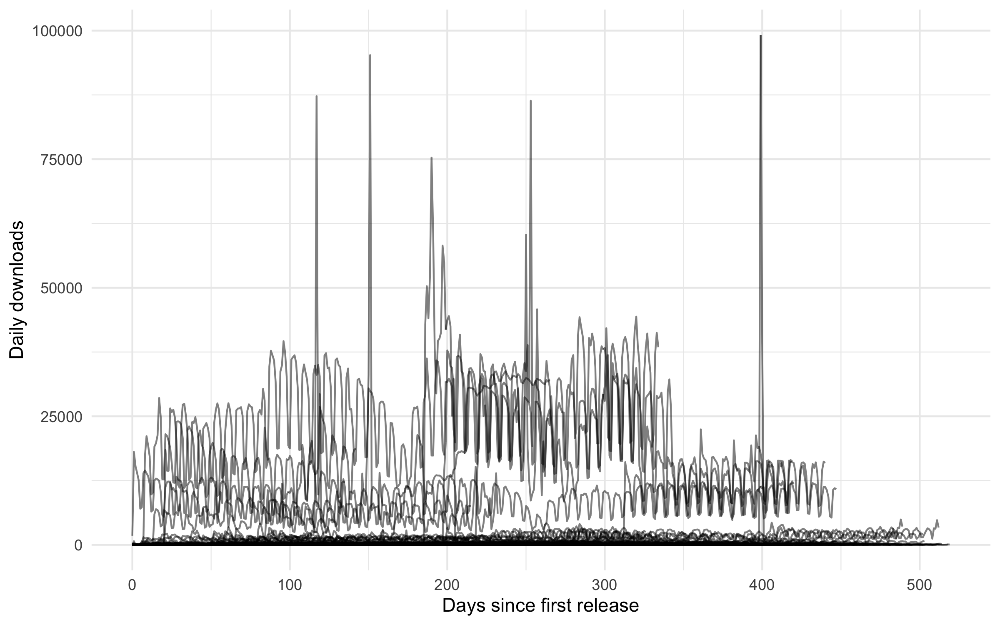
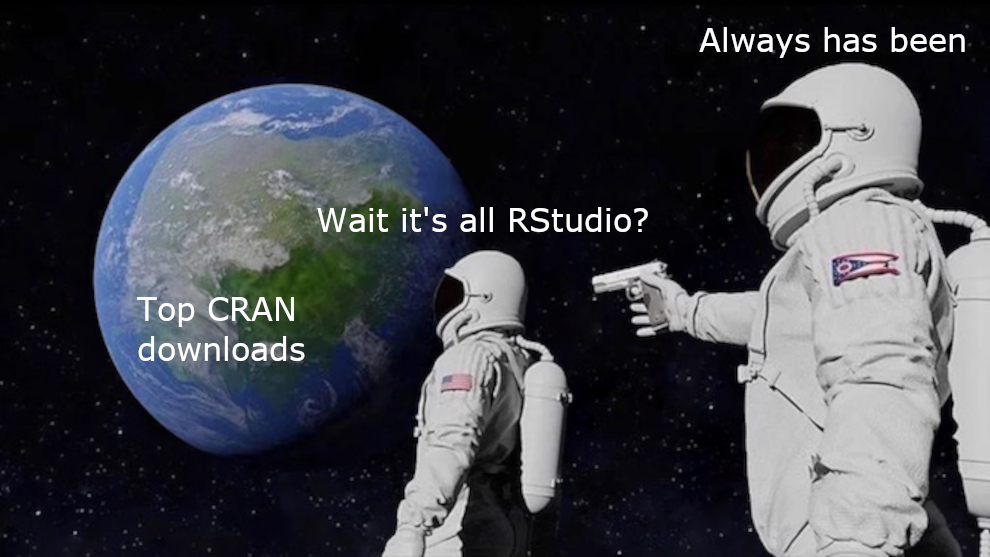
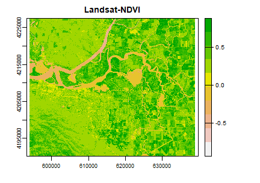
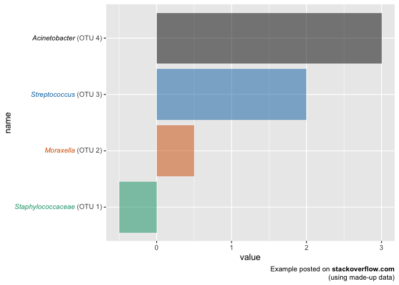
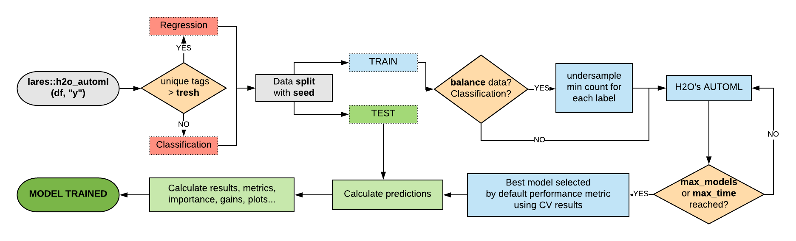
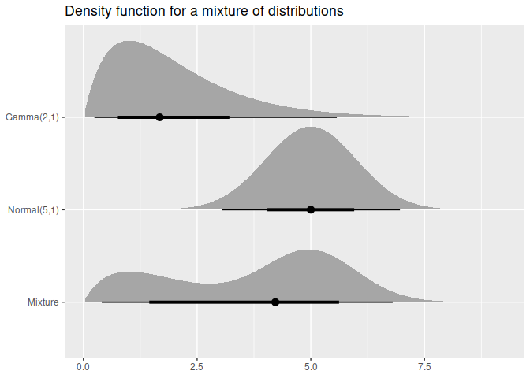
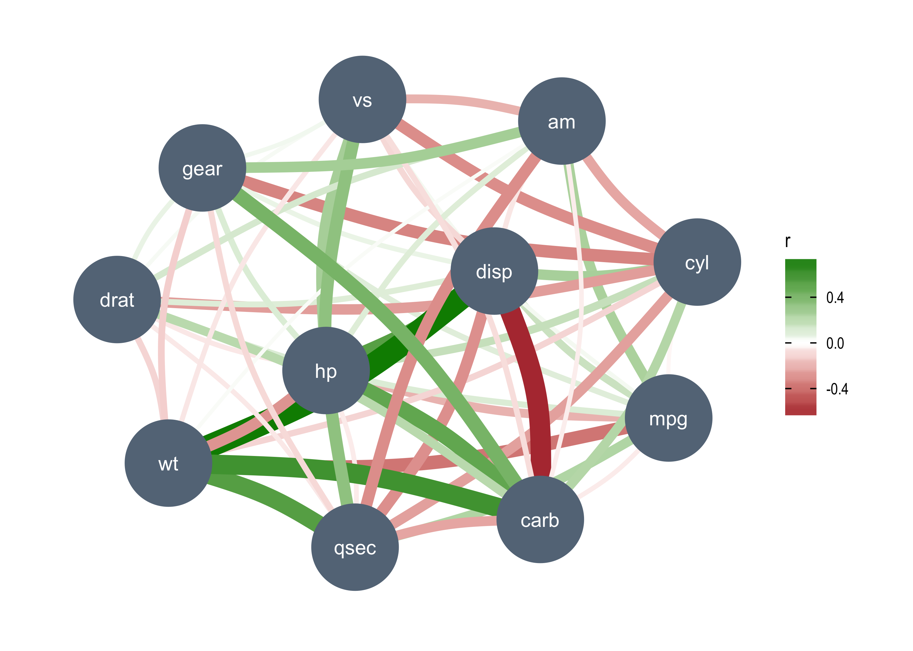

```{r setup, include=FALSE}
options(htmltools.dir.version = FALSE)

# remotes::install_github("hadley/emo")
```

background-image: url("img/user2021-4x3.png")
background-size: 100%
background-position: center

---

background-image: url("img/r-youtube.png")
background-size: 100%
background-position: center

---

class: inverse, center, middle

# R 4.1.0 (2021-05-18)

## Native pipes and function shortcut

---

# Native pipe |>

```{r}
library(magrittr)
mtcars$mpg %>% mean()
```

--

```{r}
mtcars$mpg |> mean()
```

--

This is implemented like this: 

.center[
`x |> f() |> g()` => `g(f(x))`
]

--

magrittr's `%>%` is (was, before 2.0?) more complicated

---

# Caveats 

--

1\. RHS has to be a function call

```{r, error=TRUE}
# doesn't work
mtcars$mpg |> mean
```

```{r, eval=FALSE}
# works
mtcars$mpg |> mean()
```

--

2\. Special functions are not supported

```{r, error = TRUE}
1 |> `+`(2)
```

--

```{r, error = TRUE}
mtcars |> `[[`("mpg")
```


---

# More caveats

3\. LHS is first argument to RHS

--

```{r, error=TRUE}
# doesn't work
mtcars |>
  lm(mpg ~ disp, data = .)
```

--

Need to use an anonymous function (and call it too):

```{r, eval=FALSE}
# works
mtcars |>
  (function(.) lm(mpg ~ disp, data = .))()
```

--

Same thing works for special functions

```{r, eval=FALSE}
# works
1 |>
  (function(.) . + 2)()
```

---

# Function shortcut `\()`

--

`\()` ... is equivalent to `function()` ...

--

Instead of:

```{r, eval=FALSE}
# works
mtcars |>
  (function(.) lm(mpg ~ disp, data = .))()
```

--

We can use the shortcut `\()`:

```{r, eval=FALSE}
# works
mtcars |>
  (\(.) lm(mpg ~ disp, data = .))()
```

--

Of course it works generally too

```{r}
sapply(1:5, \(x) paste(rep("a", x), collapse = ""))
```


---

# What will happen to %>%?

--

tidyverse plays nice with `|>`

--

```{r}
suppressPackageStartupMessages(library(dplyr))
mtcars |> select(mpg) |> head(2)
```

--

> [magrittr 2.0] makes the behaviour of `%>%` interchangeable with the future `|>` pipe of base R. We will maintain magrittr on CRAN for the foreseeable future [...]
>
> [...] 
>
> We also hope it will improve the experience of users until they switch to the base pipe. For all these reasons, we are very happy to bring this ultimate version of magrittr to CRAN.

https://www.tidyverse.org/blog/2020/11/magrittr-2-0-is-here/

---

# magrittr beyond %>%

<br>

.center[

]

---

# magrittr beyond %>%

--

`r emo::ji("cancel")` Dot operator that makes `mtcars %>% f(..., data = .)` possible

--

```r
Sys.setenv(`_R_USE_PIPEBIND_` = TRUE) 
mtcars |> 
   . => lm(mpg ~ disp, data = .)
```

--

`r emo::ji("cancel")` Other pipe operators: `%T>%`, `%<>%`, `%$%`

--

_Meh, not used very much?_

--

`r emo::ji("check")` Special function aliases (`?"n'est pas"`)

--

```{r, eval=FALSE}
# doesn't work
1 |> `+`(2)
# works
1 |> add(2)

mtcars |> extract2("mpg")  # [[]]
mtcars |> extract("mpg")   # []
mtcars |> set_colnames(paste0("foo_", colnames(mtcars)))  # `colnames<-`
```

---

class: inverse, center, middle

# Trending new packages on CRAN

---

# THE PLAN

<br>

> I'm going to look at the download stats for new packages released on CRAN since January 1st, 2020. Checking which ones are getting downloaded a lot and trending up is going to be great way to discover new packages!

.right[--Andreas Beger, 2 weeks ago]

---

# Reality



???

90% of packages get between 5 and 30 daily downloads

---

class: middle, center
background-color: black



--

<span style="color: white">Good discussion at https://github.com/lindbrook/packageRank</span>

---

# terra

Budding replacement for **raster**; spatial data analysis for raster (and vector) data

- By Robert J. Hijmans, also author of **raster**
- Very extensive doc/book at: https://rspatial.org/terra/index.html
- https://rspatial.github.io/terra/reference/terra-package.html

.center[

]

---

# ggtext

Improved text rendering support for ggplot2

- https://wilkelab.org/ggtext/index.html

.center[

]

---

# lares

AutoML

- https://laresbernardo.github.io/lares/index.html
- This package is booming! First up on CRAN 1 month ago

.center[

]

---

# distributional 

Vectorized distributions

```{r, eval=FALSE}
library(distributional)
my_dist <- c(dist_normal(mu = 0, sigma = 1), dist_student_t(df = 10))
my_dist
#> <distribution[2]>
#> [1] N(0, 1)     t(10, 0, 1)
```

.center[

]

---

# correlation

Methods for correlation analysis

- Part of the **easystats** ecosystem of packages
- https://easystats.github.io/correlation/

.center[

]

---

class: inverse, center, middle

More at 

---

_Rose_, from https://twitter.com/aschinchon/status/1405136386034970630?s=20

```{r cache=TRUE, out.width="60%", fig.align='center'}
suppressPackageStartupMessages(library(tidyverse))
seq(-3,3,by=.01) %>%
  expand.grid(x=., y=.) %>%
  ggplot(aes(x=(1-x-sin(y^2)), y=(1+y-cos(x^2)))) +
  geom_point(alpha=.05, shape=20, size=0)+
  theme_void()+
  coord_polar()
```


